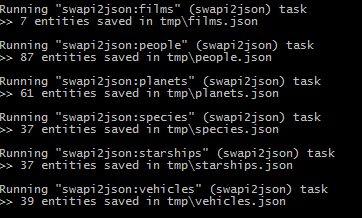

# grunt-swapi2json

> This download swapi data available at http://swapi.co/ and store them in json files. Useful when one wanted to create a generated site or one want to store those data locally.

## Getting Started
This plugin requires Grunt `~0.4.5`

If you haven't used [Grunt](http://gruntjs.com/) before, be sure to check out the [Getting Started](http://gruntjs.com/getting-started) guide, as it explains how to create a [Gruntfile](http://gruntjs.com/sample-gruntfile) as well as install and use Grunt plugins. Once you're familiar with that process, you may install this plugin with this command:

```shell
npm install grunt-swapi2json --save-dev
```

Once the plugin has been installed, it may be enabled inside your Gruntfile with this line of JavaScript:

```js
grunt.loadNpmTasks('grunt-swapi2json');
```

## The "swapi2json" task

### Overview
In your project's Gruntfile, add a section named `swapi2json` to the data object passed into `grunt.initConfig()`.
You can either download all swapi resources, or download only some of them.

#### Download all resources:

```js
grunt.initConfig({
  swapi2json: {
    all: {
      dir: './json'
    },
  },
});
```

#### Download some resources:
Use the [swapi resource(s)](http://swapi.co/documentation#root) name as a target:
```js
grunt.initConfig({
  swapi2json: {
  	options: {
		dir: './json'
	}
    films: {},
	people: {},
  },
});
```

### Options

#### dir
Type: `String`
Default value: `.`

The directory where files are be saved.


### Usage Examples

#### All
In this example, all resources are downloaded and saved. When this is used, a task for each resources are dynamically created.

```js
grunt.initConfig({
  swapi2json: {
    all: {
      dir: './json'
    },
  },
});
```


#### Save some resources in a single directory
Use [swapi resource(s)](http://swapi.co/documentation#root) as target name.

```js
grunt.initConfig({
  swapi2json: {
    options: {
		dir: './json'
	}
    films: {},
	people: {},
  },
});
```

#### Save some resources in directories
Use [swapi resource(s)](http://swapi.co/documentation#root) as target name.

```js
grunt.initConfig({
  swapi2json: {
    films: {
		dir: './starwars/movies'
	},
	people: {
		dir: './starwars/characters'
	},
  },
});
```


## Contributing
In lieu of a formal styleguide, take care to maintain the existing coding style. Add unit tests for any new or changed functionality. Lint and test your code using [Grunt](http://gruntjs.com/).

## Release History
_(Nothing yet)_
